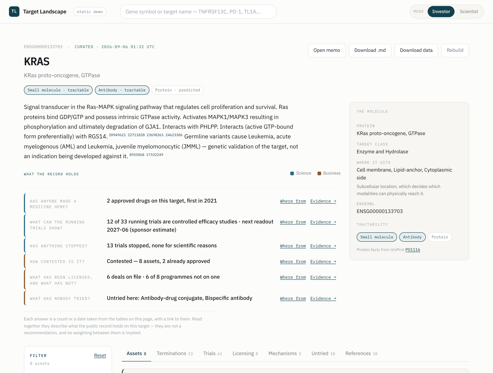
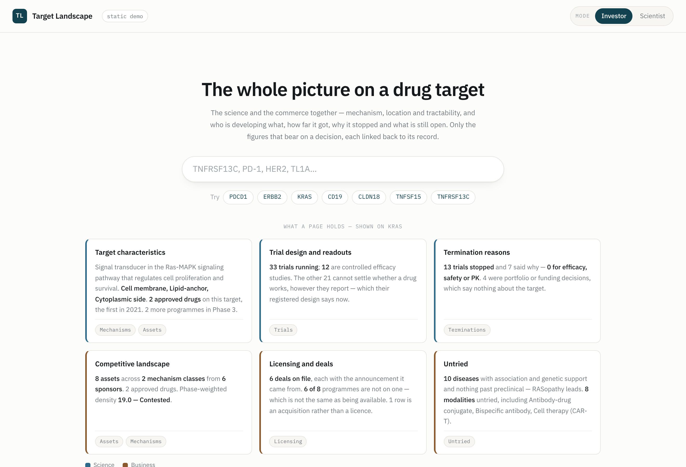
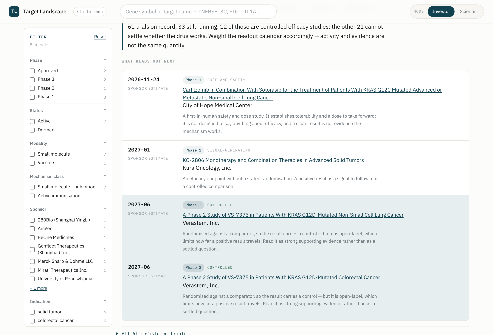
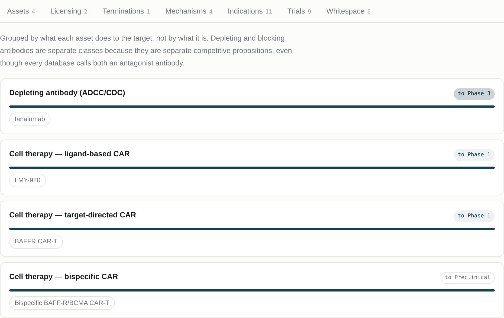
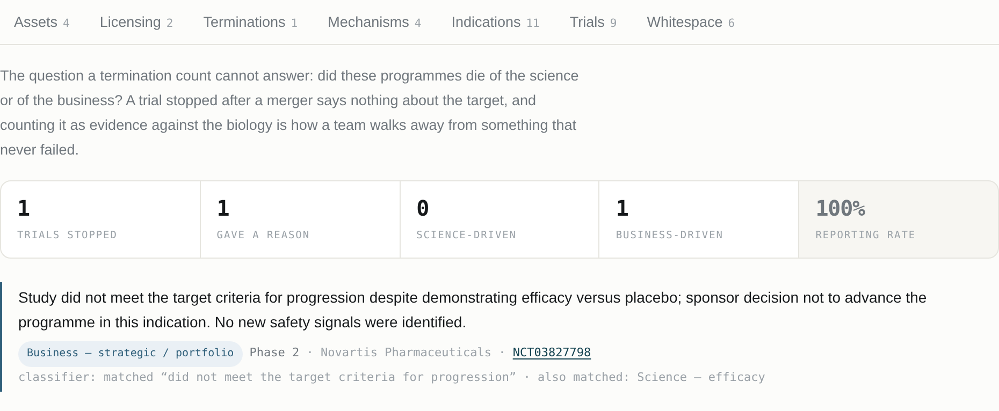
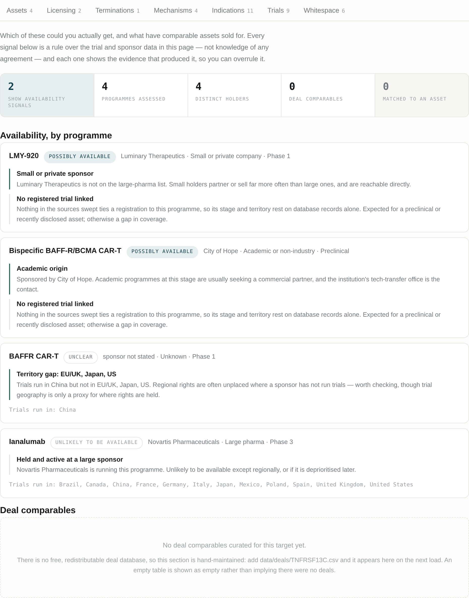

# target-landscape

**Look up a drug target. Get six answers on whether it is worth the meeting.**

[**Open the site**](https://lfr53.github.io/Target-Landscape/) · built on Open
Targets, ChEMBL, ClinicalTrials.gov, UniProt and Europe PMC · **no API key, no
model, nothing to sign up for**.

Most databases answer either the science of a target or its commerce. This
puts both on one page, and links every line back to the record it came from.

Six questions, in the order they have to be settled — three on whether the
target works, three on what can be had here, coloured by that and nothing
else:

| | | |
|---|---|---|
| **Target characteristics** | What the protein is, where it sits, and how far anyone has got with it | science |
| **Trial design and readouts** | How much of the running activity is a controlled efficacy trial, and how much only looks like one | science |
| **Termination reasons** | Why programmes stopped, and what that does and does not say about the target | science |
| **Competitive landscape** | Who is developing what, grouped by mechanism, phase-weighted rather than counted | business |
| **Licensing and deals** | What has been licensed, on whose announcement, and which programmes have never been on a deal | business |
| **Untried** | A modality that could reach this protein and has not been tried, or a disease with evidence and nothing in the clinic | business |



```bash
pip install -r requirements-web.txt
uvicorn web.app:app --reload          # → http://127.0.0.1:8000
```

**On Windows**, double-click `1-SETUP.bat` then `2-START-WEBSITE.bat` — no
terminal required. See [WINDOWS.md](WINDOWS.md).

The same analysis runs as a command line tool and as a document:

```bash
python -m landscape KRAS               # → out/KRAS_landscape.html
```

---

## The interface

Each target page opens with the six answers above — one sentence of judgement
per question, at most three lines of evidence, the table behind a disclosure.
No summary strip of raw counts: a number with no verdict attached hands the
reader the work this page exists to do. Raw data is linked out to Open
Targets, ClinicalTrials.gov and Europe PMC rather than copied — they do
tables better than this page can.

The home page shows what a target page holds instead of describing it: six
tiles carrying the real figures from a real target, derived from the same
stored landscape the target page renders.



Then the views — one filter state drives all of them, so narrowing to
antibodies narrows the mechanism list, the trial table and the termination
notices together:

| View | Answers |
|---|---|
| **Assets** | Every programme, sortable, with a panel per asset showing its trials and the source of each field |
| **Mechanisms** | Grouped by what each asset *does* to the target — plus where the target sits on its pathway, its drugged neighbours, and which modalities could reach it and have not been tried |
| **Trials** | What reads out next and what each result could actually prove, from the registered design |
| **Terminations** | The sponsor's own stated reason, classified and quoted |
| **Licensing** | Deals already done, each with its source — then every programme on the target and whether one is on file for it |
| **Untried** | Well-evidenced diseases with nothing in the clinic, and modalities nobody has taken |
| **Reading** | The most-cited reviews and recent mechanism work, from Europe PMC |





Terminations — the sponsor's own words, classified, with the matched phrase
shown so you can overrule the call:



Licensing — what has been transacted and what has not, no score on either:



**Investor / Scientist** switches which figures lead and which view opens
first. Nothing is hidden either way — both stay one click apart.

**Search finds targets by the names people use.** Nobody types `TNFRSF13C` —
they type BAFF-R. Nobody types `ERBB2` — they type HER2. Instant, offline,
alias-aware.

```bash
python scripts/seed_target_index.py     # ~200 hand-checked drug targets, ships in the repo
python scripts/build_target_index.py    # expands it to every approved human gene (HGNC)
```

**Two tiers, and the page says which one you're reading.** Curated targets
are precomputed and committed: instant, and cannot fail, because serving one
touches no external API. Anything else is built live from the same public
sources — 20 to 40 seconds, staged rather than a spinner, then cached.

```bash
python scripts/precompute.py --set calibration/targets.txt   # seed the curated tier
python scripts/recompute_curated.py                          # re-run current rules, no network
```

### Deploying

The published site is static, because the site already is: every curated
target is precomputed and committed, and a server is only needed to build
something outside that set.

```bash
python scripts/make_static_demo.py --out-dir site      # a shell plus one file per target — what the published site runs
python scripts/make_static_demo.py --out out/demo.html # one self-contained file, for sending to someone
```

`.github/workflows/pages.yml` rebuilds the first of those from a clean
checkout on every push and publishes it to GitHub Pages, so what is online is
what the repository can rebuild. Live lookup is the one thing the published
copy cannot do, and it says so rather than offering a search it can't honour.

---

## Why this is not a search tool

Listing the drugs against a target is solved — Open Targets does it free,
Cortellis and Evaluate do it commercially. Listing is not the work. The work
is the judgements a landscape has to make:

**1. An asset counts only if the record names this target.**
Searching a registry for a protein's *full name* fails silently: MAP3K14's
full name returned 228 assets and 13 "approved drugs," among them
hydrochlorothiazide — the words simply co-occurred somewhere. Matching runs
on identifiers, never on protein names; a trial counts only when its own
record names the drug and the target; population context is scored per
field, not across a concatenated string. The same layer folds salt forms,
catches ChEMBL synonym collisions that merge distinct drugs, and drops rows
that aren't molecules — diagnostic assays, biomarker cohorts, class labels
like "PD-1/PD-L1 inhibitor" (a protocol letting the investigator choose, not
a drug).

**2. Assets are grouped by mechanism, not counted.**
Five antibodies against a receptor are one competitive situation if they
block the ligand and a different one if two of them deplete the cell. The
classifier reads WHO INN stems (`-mab`, `-cept`, `-leucel`, `-siran`)
alongside ChEMBL `action_type` and mechanism text, so it places assets with
no database record at all — where the cell therapies and non-Western
programmes usually live. Where the record states the pharmacology but not
the molecule, the label says exactly that (*inhibition, modality
unresolved*) instead of discarding the half that's known.

**3. Terminations are classified into five causes: efficacy/safety/PK,
business, operational, manufacturing, unstated.**
A raw termination count is worse than useless — funding runs out, a merger
reshuffles the portfolio, a supply line fails, COVID closes a site. Counting
any of that as evidence against the biology walks a team away from a target
that never failed. `whyStopped` — the sponsor's own one-line account, almost
never used because it's unstructured text behind a paginated API — is
classified with the verbatim notice kept alongside.

BAFF-R is the case in point. Novartis stopped a Phase 2b saying the study
*"did not meet the target criteria for progression despite demonstrating
efficacy versus placebo… No new safety signals were identified."* Keyword
matching reads "safety" and inverts the conclusion. This tool masks negated
clauses, classifies it as a portfolio decision, and shows that it also
matched efficacy — so the reader can disagree with the call rather than
inherit it.

**4. Density is phase-weighted, and shows its weights.**
One Phase 3 competitor prices at four Phase 1s. Dormant programmes — every
linked trial stopped, nothing running — are reported separately rather than
inflating the count. Weights and band thresholds are printed on the page,
because a score nobody can recompute isn't an analysis.

**5. Licensing is reported, not scored.**
Other databases answer "what exists." A BD or search-and-evaluation team has
assumed that already and is asking *which of these could I get, and who do I
call*. Two lists, no score: deals already done, each with its source
announcement; and every programme on the target — holder, stage, last
readout, and whether a deal is on file. The ones with no deal are the
negotiable ones. An earlier version scored availability and averaged deal
size; both are gone — the weights were never checked against an outcome, and
a median over a handful of hand-entered rows isn't a statistic worth
showing. Deal rows are entered by hand from the parties' own announcements,
because no free database of terms can be redistributed — a blank section
means nobody has entered one, not that nothing has been licensed.

**6. Untried requires evidence, not just absence.**
A disease qualifies only when the Open Targets association clears a
threshold *and* carries genetic support *and* has nothing past preclinical.
Disease-name matching by substring fails ("Sjogren syndrome" vs "Sjogren's
Disease"), so names are compared by stemmed token overlap, and the section
is labelled a screen to check by hand, not a finding.

**No model, anywhere.** Every number above is a rule over a public record,
reproducible offline and traceable to its source. Where a model would
genuinely help — classifying free text — the right shape is offline: draft
candidates, have a person confirm them, commit the result as a sourced CSV.
The pipeline itself still runs on rules.

---

## Quickstart

Python 3.9+. The pipeline itself needs nothing beyond the standard library.

```bash
git clone https://github.com/lfr53/Target-Landscape.git
cd Target-Landscape

python -m landscape doctor             # check the APIs before trusting a run
python -m landscape KRAS               # live run against the public APIs
python -m landscape KRAS ERBB2 PDCD1 --out out/   # several targets, plus an index comparing them
python -m landscape --fixture fixtures/TNFRSF13C.json   # offline demo, no network
python -m landscape --calibrate --out out/calibration   # reference set, one density scale

python -m landscape KRAS \
  --out out/ \
  --format html,md,json \
  --deals data/deals/KRAS.csv \
  --save-fixture fixtures/KRAS.json

python -m unittest discover -s . -p "test_*.py"
```

### `doctor`

The three public APIs rename fields between releases with no warning. The
first symptom is not a crash — it's a memo that renders perfectly and says
nothing. `doctor` probes each source with the pipeline's own queries and
names the field that moved:

```
Open Targets
  [  ok  ] reachable
  [  ok  ] resolves a gene symbol
  [ FAIL ] target core fields
              empty fields: tractability
              → update _TARGET_QUERY in sources/opentargets.py
```

Responses are cached under `~/.cache/target-landscape`, so re-running a
target is instant and doesn't re-hit the APIs.

### As a library

```python
from landscape import build, to_html

ls = build("KRAS")
print(ls.crowding["verdict"], ls.crowding["weighted_score"])
for a in ls.assets[:5]:
    print(a.name, a.phase_label, a.mechanism_class, a.sponsor)
open("memo.html", "w").write(to_html(ls))
```

---

## Data sources

| Source | Carries | Licence |
|---|---|---|
| [Open Targets Platform](https://platform.opentargets.org/) | target identity, tractability, known drugs, disease associations with genetic evidence | CC0 |
| [ChEMBL](https://www.ebi.ac.uk/chembl/) | `action_type`, molecule type, max phase, withdrawal flags | CC BY-SA 3.0 |
| [ClinicalTrials.gov API v2](https://clinicaltrials.gov/data-api/api) | trials, phases, sponsors, conditions, geography, `whyStopped` | US Government public domain |
| [UniProt](https://www.uniprot.org/) | curated function, subcellular location, domains | CC BY 4.0 |
| [Europe PMC](https://europepmc.org/) | reviews and recent mechanism papers | per-record |

Three layers are maintained by hand, each row requiring a source URL:
`data/deals/*.csv` (deal terms, from the parties' own announcements),
`data/assets/*.csv` (programmes the registries name only by a code), and
`data/pathways.csv` (where a target sits, cited to UniProt). Subscription
databases aren't used — their licences forbid redistributing what they
contain.

---

## Known limits

Stated here and on every page the tool produces:

- **The published site carries the curated set.** Anything else opens onto a
  page saying it isn't built. Running the project locally builds any human
  gene from the same public sources.
- **Registry coverage.** Only ClinicalTrials.gov is swept — China- and
  Japan-only registrations are under-represented.
- **Preclinical and undisclosed programmes are invisible.**
- **The deal layer is small and hand-entered** — sourced rows, not a market
  sample, which is why nothing is averaged over it.
- **A registry entry with only a code name can't be classified.** Those rows
  say so instead of being guessed at, and are resolved by hand into
  `data/assets/`.
- **`whyStopped` is self-reported and often absent** — the page prints the
  reporting rate.
- **Disease-name matching is stemmed token overlap, not ontology mapping.**
- **The density bands are a convention**, printed on the page and documented
  in [ARCHITECTURE.md](ARCHITECTURE.md) — not calibrated against outcomes.

## Repository

```
landscape/
  models.py            data model; every fact carries provenance
  config.py            endpoints and every constant that feeds a judgement
  http.py              cached, retrying stdlib HTTP client
  sources/             Open Targets · ChEMBL · ClinicalTrials.gov · UniProt · Europe PMC
  relevance.py         does this record actually name this target, and this drug
  normalize.py         reconciliation — identity, phase, modality, sponsor
  consistency.py       invariants: a headline figure must equal its own table
  analysis/
    mechanism.py       INN stems + mechanism vocabulary → mechanism classes
    failures.py        whyStopped → five causes
    crowding.py        phase-weighted density, indications, untried diseases
    licensing.py       deals on file, and where each programme stands
    feasibility.py     the six questions
    showcase.py        the six tiles, from the same stored landscape
  render.py            HTML + Markdown memo, and the multi-target index
  doctor.py            API health and schema-drift check
  store.py             curated tier + live-build cache + the hand-maintained layers
  targets.py           the searchable index: symbols, aliases, ranked lookup
  pipeline.py          orchestration; sources degrade, runs do not abort
web/
  app.py               FastAPI: search, lookup, build jobs, exports
  static/              the interface — no framework, no build step
data/curated/          precomputed targets, committed
data/deals/            deal terms, hand-entered, one CSV per target
data/assets/           programmes the registries name only by a code
data/pathways.csv      where each target sits, cited to UniProt
data/target_index.json the searchable target index
scripts/               precompute, recompute, static export
fixtures/              offline demo + regression input
calibration/           reference target set for deriving the density bands
tests/                 262 tests — parser contracts against realistic payloads,
                       the judgement layer, and the web layer; all offline
```

The engine (`landscape/`) has no web dependencies and doesn't know the site
exists — only `web/` needs FastAPI. That's what lets one analysis serve a web
request, a command line run and a CI job without three versions of it.

Every test runs without network, against payloads in `tests/payloads.py`
shaped like what these APIs actually emit, malformed records included.

See [ARCHITECTURE.md](ARCHITECTURE.md) for the design decisions and how the
constants were calibrated.

## Licence

MIT for the code. The data carries its own licences — see the table above.
